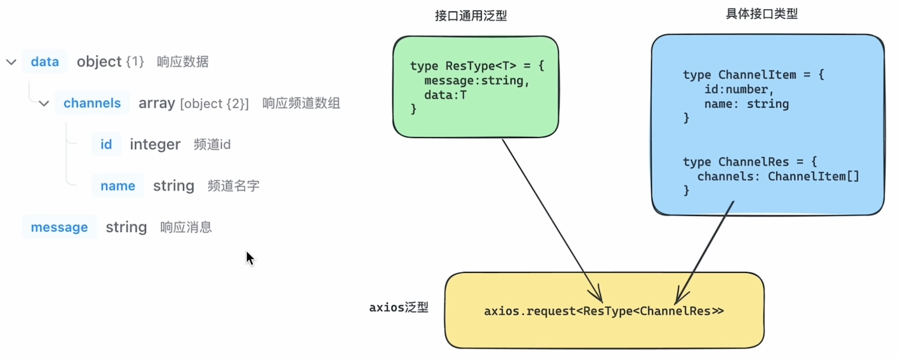
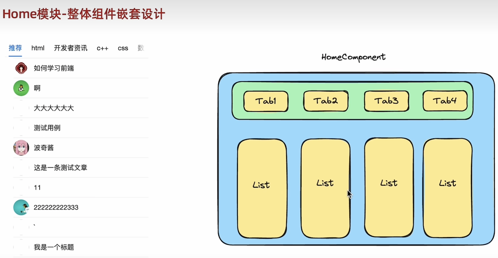
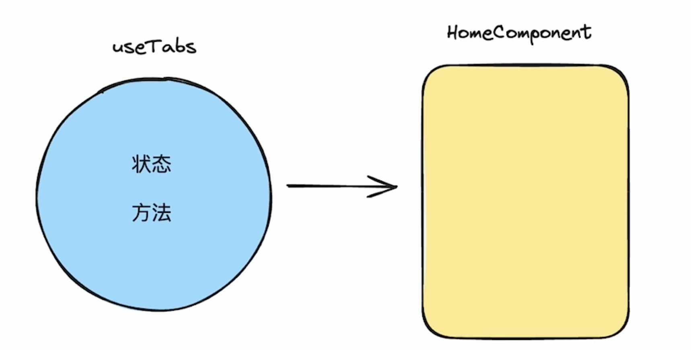

## React + TypeScript + Vite

### 1. 项目环境创建

1. 安装vite工具，并创建项目

    ```bash
    yarn create vite
    ```

2. 设置项目名称

    ```bash
    ? Project name: › react-jike-mobile  // 项目名称
    ```

3. 选择react框架

    ```bash
    ? Select a framework: › - Use arrow-keys. Return to submit.
        Vanilla
        Vue
    ❯   React
        Preact
        Lit
        Svelte
        Solid
        Qwik
        Others
    ```

4. 选择开发语言环境ts

    ```
    ? Select a variant: › - Use arrow-keys. Return to submit.
    ❯   TypeScript
        TypeScript + SWC
        JavaScript
        JavaScript + SWC
    ```

5. 进入项目文件夹，并运行安装包依赖

    ```
    cd react-jike-mobile
    ```

    ```
    yarn 
    ```

6. 运行项目，测试是否安装成功

    ```
    yarn dev
    ```

7. 整理文件结构，生成空白页面

    - 删除src下的部分文件，只保留App.tsx, main.tsx, cite-env.d.ts

    - 清理App.tsx的内容

        ```
        function App() {
          return <>this is an app</>;
        }
        export default App;
        ```

    - 清理main.tsx的内容（删除严格模式）

        ```tsx
        import ReactDOM from "react-dom/client";
        import App from "./App.tsx";
        
        ReactDOM.createRoot(document.getElementById("root")!).render(<App />);
        ```


### 2. 安装antDesignMobile组件库

1. [ant Design Mobile](https://mobile.ant.design/zh)是ant Design家族里专门针对移动端的组件库

2. 查看文档，安装并使用

    - 安装

        ```
        yarn add antd-mobile
        ```

    - 直接引入组件即可，antd-mobile 会自动为你加载 css 样式文件

        ```
        import { Button } from 'antd-mobile'
        ```

    - 在 App中测试一下

        ```tsx
        import { Button } from "antd-mobile";
        function App() {
          return (
            <>
              <p>this is an app</p>
              <Button>this is a button</Button>
            </>
          );
        }
        export default App;
        ```

3. 在文档中搜索Button 按钮，探索更多属性的使用

    ```tsx
    import { Button } from "antd-mobile";
    function App() {
      return (
        <>
          <p>this is an app</p>
          <Button color="success" fill="outline">  {/* 鼠标放置到Button时，ts会自动提示属性和属性值 */}
            this is a button
          </Button>
        </>
      );
    }
    export default App;
    ```


### 3. 配置路径别名

1. 使用场景：项目中各个模块之间的相互导入导出，可以通过@别名路径来做路径的简化。经过配置@相当于src目录。

2. 比如：

    - 配置之前的路径

        ```tsx
        import Detail from ' .. /pages/Detail '
        ```

    - 配置之后的路径

        ```tsx
        import Detail from '@/pages/Detail '
        ```

3. 步骤：

    - 让Vite做路径解析（真实的路劲转换）

        - vite.config.ts中添加配置对象

            ```ts
            import { defineConfig } from "vite";
            import react from "@vitejs/plugin-react";
             // 引入path对象
            import path from "path";
            
            // https://vitejs.dev/config/
            export default defineConfig({
              plugins: [react()],
            
              // 配置路径别名
              resolve: {
                alias: {
                  "@": path.resolve(__dirname, "src"),
                },
              },
            });
            ```

        - 如果你是刚创建的TypeScript项目，有可能会遇到`找不到模块“path”或其相应的类型声明`的错误提示，安装`@types/node`即可

            ```bash
            yarn add @types/node -D
            ```

    - 让VSCode做智能路径提示（开发者体验）

        -  tsconfig.json中添加配置项

            ```json
            {
              "compilerOptions": {
               ...
                "skipLibCheck": true,
            
                // 别名路径的配置项
                "baseUrl": ".",
                "paths": {
                  "@/*": ["src/*"]
                },
            
                /* Bundler mode */
                "moduleResolution": "bundler",
                "allowImportingTsExtensions": true,
               ...
              }
            ```

4. 测试配置是否成功

    -  修改main.ts的路径

        ```tsx
        import ReactDOM from "react-dom/client";
        import App from "@/App"; // 使用路径别名
        
        ReactDOM.createRoot(document.getElementById("root")!).render(<App />);
        ```
        
- 键入@之后会有自定提示的引用文件


### 4. 配置基础路由

1. 安装路由包

    ```bash
    yarn add react-router-dom  
    ```

2. 创建基础page组件，用来匹配路由

    - src文件下创建pages文件夹，并创建Home和Detail页面组件

    - Home组件文件夹下创建index组件界面

        ```tsx
        const Home = () => {
          return (
            <>
              <p>this is Home</p>
            </>
          );
        };
        export default Home;
        ```

    - Detail组件文件夹下创建index组件界面

        ```tsx
        const Detail = () => {
          return (
            <>
              <p>this is Detail</p>
            </>
          );
        };
        export default Detail;
        ```

3. 创建路由表文件

    -  src文件下创建router文件夹，并创建index.tsx路由文件( 注意：这里是tsx格式，ts或js的话，类型报错)

    - index.ts文件中配置路由： 使用**createBrowserRouter**方法创建router实例并导出，createBrowserRouter方法插入配置数组对象（一个一个路由对象）

        ```ts
        import { createBrowserRouter } from "react-router-dom";
        import Home from "@/pages/Home";
        import Detail from "@/pages/Detail/index";
        
        const router = createBrowserRouter([
          {
            path: "/",
            element: "<Home/>",
          },
          {
            path: "/detail",
            element: "<Detail/>",
          },
        ]);
        
        export { router };
        ```

4. Main.ts文件中导入路由表

    - 引入RouterProvider，并传入router对象

        ```tsx
        import ReactDOM from "react-dom/client";
        // import App from "@/App";
        
        
        import { RouterProvider } from "react-router-dom";
        import { router } from "@/router";
        
        ReactDOM.createRoot(document.getElementById("root")!).render(
          <RouterProvider router={router} /> // 这里替换掉App组件
        );
        ```
    
5. 测试配置是否成功
    - http://localhost:5173/
    - http://localhost:5173/detail


### 5. axios基础封装

1. 使用场景：axios作为最流行的请求插件，同样是类型友好的，基于axios做一下基础封装

2. 步骤

    1.  安装axios到项目

        ```bash
        yarn add axios  
        ```

    2. 在utils中封装http模块，主要包括接口基地址，超时时间，拦截器

        - src下新建utils文件夹，并创建http.ts文件
        - http.ts文件中使用axios.**create**方法创建http请求实例httpInstance，并掺入配置对象（设置基路径和请求响应时间）

        -  设置请求拦截器和响应拦截器

        - 导出http请求实例httpInstance

            ```ts
            import axios from "axios";
            
            // 创建http请求实例httpInstance
            const httpInstance = axios.create({
             baseURL: 'http://geek.itheima.net/v1_0',
              timeout: 5000,
            });
            
            // 添加请求拦截器
            httpInstance.interceptors.request.use(
              (config) => {
                return config;
              },
              (error) => {
                return Promise.reject(error);
              }
            );
            
            // 添加响应拦截器
            httpInstance.interceptors.response.use(
              (response) => {
                // 2xx 范围内的状态码都会触发该函数。
                // 对响应数据做点什么
                return response;
              },
              (error) => {
                // 超出 2xx 范围的状态码都会触发该函数。
                // 对响应错误做点什么
                return Promise.reject(error);
              }
            );
            
            // 导出http请求实例
            export { httpInstance };
            ```

    3. 在utils中做统一导出

        -  utils下创建index.ts文件，用于统一导出http请求的中转

            ```ts
            import { httpInstance } from "@/utils/http";
            
            export { httpInstance as http };
            ```

3. 使用： 在所需的api中导入http并使用


### 6. 封装api模块 - axios和ts的配合使用

1. 场景：

    -   axios提供了request泛型方法，方便我们传入类型参数推导出接口返回值的类型

        ```ts
        axios.request<Type>(requestConfig).then(res=>{
        	console.log(res.data)
        })
        ```

    - 说明：我们需要根据返回值的类型，自定义泛型参数Type，并传入给request方法。这样泛型参数Type的类型就决定了res.data的类型

2. 步骤：

    1. 根据接口文档创建一个通用的泛型接口类型（多个接口返回值的结构是相似的）

    2. 根据接口文档创建特有的接口数据类型（每个接口有自己特殊的数据格式）

    3. 组合1和2的类型，得到最终的request泛型的参数类型

        

3.  实现

    1. src文件夹先创建apis模块，新建list.ts文档

    2. list.ts文档中定义数据类型，并创建请求列表的api接口方法，并导出

        ```ts
        import { http } from "@/utils";
        
        //1. 定义通用的泛型参数:传递不同的T，定义不同的data类型
        type ResType<T> = {
          data: T;
          message: string;
        };
        
        //定义具体的接口数据类型（channel的类型）
        type ChannelItem = {
          id: number;
          name: string;
        };
        
        //2. channels的类型
        type ChannelRes = {
          channels: ChannelItem[];
        };
        
        // 定义请求频道列表的api,并传入数据类型(组合上面的 1 和 2 类型)
        export const fetchChannelAPI = () => {
          return http.request<ResType<ChannelRes>>({
            url: "/channels",
          });
        };
        
        ```

4. 测试接口

    - main.ts文件中导入fetchChannelAPI接口，并使用

        ```tsx
        import ReactDOM from "react-dom/client";
        
        import { RouterProvider } from "react-router-dom";
        import { router } from "@/router";
        import { fetchChannelAPI } from "@/apis/list";
        
        // api接口测试
        fetchChannelAPI().then((res) => {
          console.log(res.data.data.channels);
        });
        
        ReactDOM.createRoot(document.getElementById("root")!).render(
          <RouterProvider router={router} />
        );
        ```
        

5. 优化： 将通用的泛型参数定义，提取出来，能让其他api接口导入使用

    - api下新建文件sharedType.ts

    - sharedType.ts文件中创建通用的泛型参数，并导出

        ```ts
        export type ResType<T> = {
          data: T;
          message: string;
        };
        ```

    - list.ts文档中直接导入，并使用

        ```tsx
        import { http } from "@/utils";
        
        // 导入通用的泛型参数
        import { ResType } from "@/apis/sharedType";
        
        //定义具体的接口数据类型（channel的类型）
        type ChannelItem = {
          id: number;
          name: string;
        };
        
        //2. channels的类型
        type ChannelRes = {
          channels: ChannelItem[];
        };
        
        // 定义请求频道列表的api,并传入数据类型
        export const fetchChannelAPI = () => {
          return http.request<ResType<ChannelRes>>({
            url: "/channels",
          });
        };
        ```

        

6. vite工具通用的泛型参数的设置

    - 使用vite工具时，也可以将通用的泛型参数写入vite-env.d.ts中，这样，不需要导出，使用时也不需要导入

    - src文件夹下的vite-env.d.ts文件中定义通用的泛型参数

        ```ts
        /// <reference types="vite/client" />
        
        // api接口响应参数的泛型（公共部分）
        type ResType<T> = {
          data: T;
          message: string;
        };
        ```

    - list.ts文档中无需导入直接使用即可

        ```ts
        import { http } from "@/utils";
        
        //定义具体的接口数据类型（channel的类型）
        type ChannelItem = {
          id: number;
          name: string;
        };
        
        //2. channels的类型
        type ChannelRes = {
          channels: ChannelItem[];
        };
        
        // 定义请求频道列表的api,并传入数据类型
        export const fetchChannelAPI = () => {
          return http.request<ResType<ChannelRes>>({ // 不需要导入通用的泛型参数ResType，直接使用
            url: "/channels",
          });
        };
        ```

    

### 7. Home模块—Channels基础数据渲染

1. 模块组件设计：

    - 整体组件嵌套设计

        

    - 说明：点击不同的标签，切换不同的内容

2. 基础布局的搭建

    - Home文件夹下样式文件index.css

        ```css
        .tabContainer{
          position: fixed;
          height: 50px;
          top: 0;
          width: 100%;
        }
        .listContainer{
          position: fixed;
          top: 50px;
          bottom: 0;
          width: 100%;
        }
        ```

    - 组件中引入index.css样式，并创建tab布局容器

        ```tsx
        import "@/pages/Home/index.css";
        const Home = () => {
          return (
            <>
              <div className="tabContainer">
                {/* tab标签布局区域 */}
                this is Home
              </div>
            </>
          );
        };
        export default Home;
        ```

3. tab布局区域实现步骤

    - 使用ant-mobile组件库中的Tabs组件进行页面结构的创建

        ```tsx
        import "@/pages/Home/index.css";
        import { Tabs } from "antd-mobile";
        const Home = () => {
          return (
            <>
              <div className="tabContainer">
                {/* tab标签布局区域 */}
                <Tabs>
                  <Tabs.Tab title="水果" key="fruits">
                    {/* list组件 */}
                    菠萝
                  </Tabs.Tab>
                  <Tabs.Tab title="蔬菜" key="vegetables">
                    {/* list组件 */}
                    西红柿
                  </Tabs.Tab>
                  <Tabs.Tab title="动物" key="animals">
                    {/* list组件 */}
                    蚂蚁
                  </Tabs.Tab>
                </Tabs>
              </div>
            </>
          );
        };
        export default Home;
        ```

    - 使用真实接口数据进行渲染(调用已经封装的接口)

        ```tsx
        import { ChannelItem, fetchChannelAPI } from "@/apis/list";
        import "@/pages/Home/index.css";
        import { Tabs } from "antd-mobile";
        import { useEffect, useState } from "react";
        
        const Home = () => {
            
          // 1. 创建状态变量，并使用泛型ChannelItem[]来限定useState返回值的类型
          const [channels, setChannels] = useState<ChannelItem[]>([]);
        
          // 2.  调用api接口获取真实数据
          useEffect(() => {
            const getChannels = async () => {
              try {
                const res = await fetchChannelAPI();
                // 3.  保存数据到状态变量中
                setChannels(res.data.data.channels);
              } catch (error) {
                throw new Error("fetch channel API error: " + error);
              }
            };
            getChannels();
          }, []);
          return (
            <>
              <div className="tabContainer">
                {/* tab标签布局区域 */}
                <Tabs defaultActiveKey="1">
        
                  {/* 4. 动态渲染数据到组件中 */}
                  {channels.map((item) => (
                    <Tabs.Tab title={item.name} key={item.id}>
                      {/* list组件 */}
                    </Tabs.Tab>
                  ))}
                  
                </Tabs>
              </div>
            </>
          );
        };
        export default Home;
        ```

4. tab布局的优化 - 数据和布局相分离

    - 场景：当前状态数据的各种操作逻辑和组件的渲染是写在一起的，可以采用自定义hook封装，让逻辑和渲染相分离

        

    - 步骤：

        1. 把和Tabs相关的响应式数据状态以及操作数据的方法放到自定义hook函数中
        
            - src先创建hooks文件夹，并创建**useTabs** 自定义hook函数，并导出
        
                ```ts
                import { ChannelItem, fetchChannelAPI } from "@/apis/list";
                import { useState, useEffect } from "react";
                
                export const useTabs = () => {
                  // 1. 创建状态变量，并使用泛型ChannelItem[]来限定useState返回值的类型
                  const [channels, setChannels] = useState<ChannelItem[]>([]);
                
                  // 2.  调用api接口获取真实数据
                  useEffect(() => {
                    const getChannels = async () => {
                      try {
                        const res = await fetchChannelAPI();
                        // 3.  保存数据到状态变量中
                        setChannels(res.data.data.channels);
                      } catch (error) {
                        throw new Error("fetch channel API error: " + error);
                      }
                    };
                    getChannels();
                  }, []);
                
                  return { channels };
                };
                ```
        
        2. 组件中调用自定义hook函数，消费其返回的数据和方法
        
            - HOME组件中调用useTabs钩子，并解构出channels 使用
        
                ```tsx
                import { useTabs } from "@/hooks/useTabs";
                import "@/pages/Home/index.css";
                import { Tabs } from "antd-mobile";
                const Home = () => {
                  // 组件中调用自定义hook函数，消费其返回的数据和方法
                  const { channels } = useTabs();
                  return (
                    <>
                      <div className="tabContainer">
                        {/* tab标签布局区域 */}
                        <Tabs defaultActiveKey="1">
                          {/* 动态渲染数据到组件中 */}
                          {channels.map((item) => (
                            <Tabs.Tab title={item.name} key={item.id}>
                              {/* list组件 */}
                            </Tabs.Tab>
                          ))}
                        </Tabs>
                      </div>
                    </>
                  );
                };
                export default Home;
                ```
        
                

5. 发斯蒂

    

     
