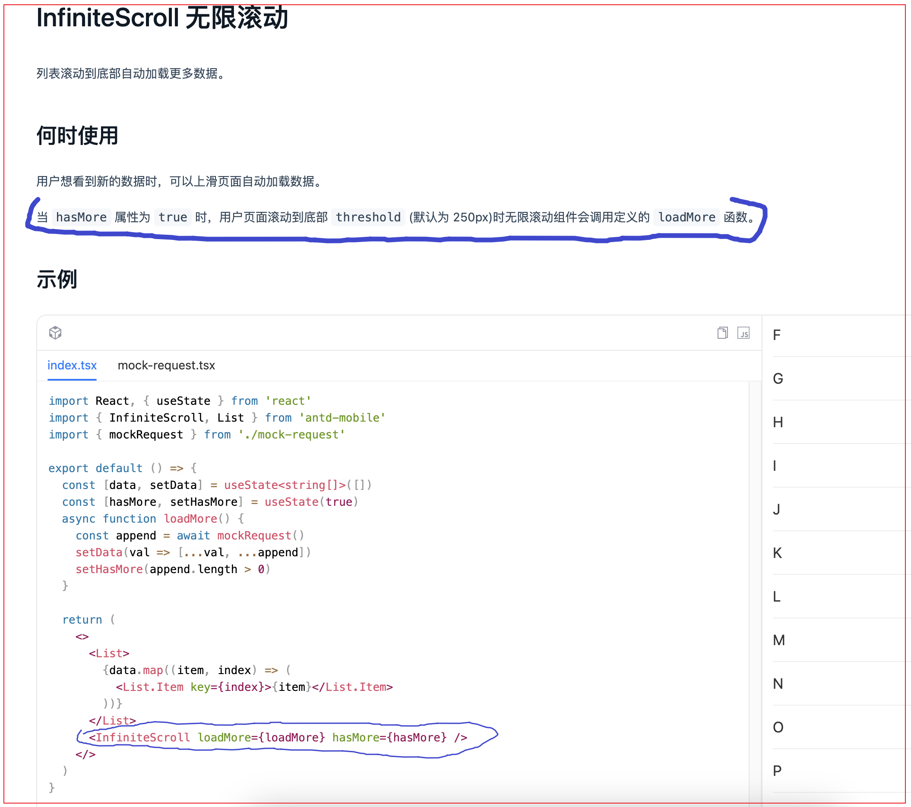
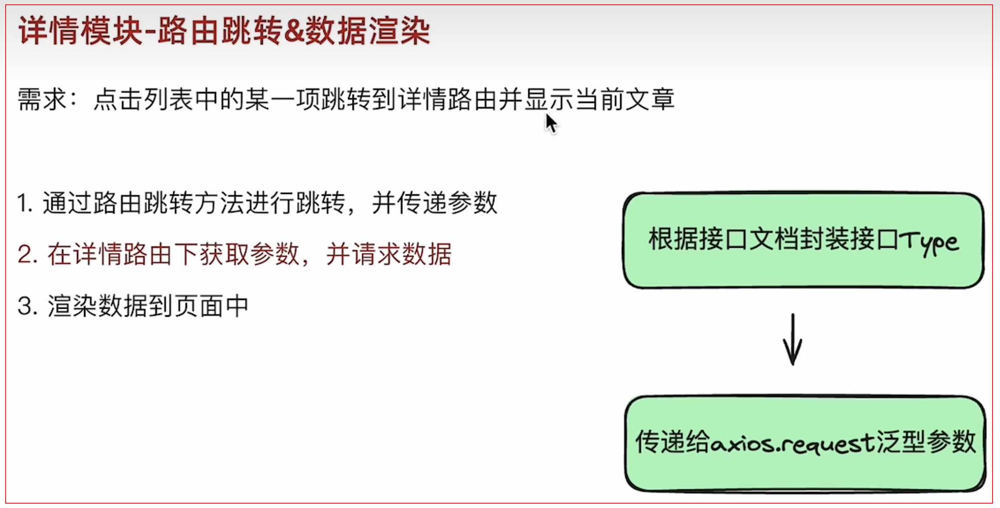
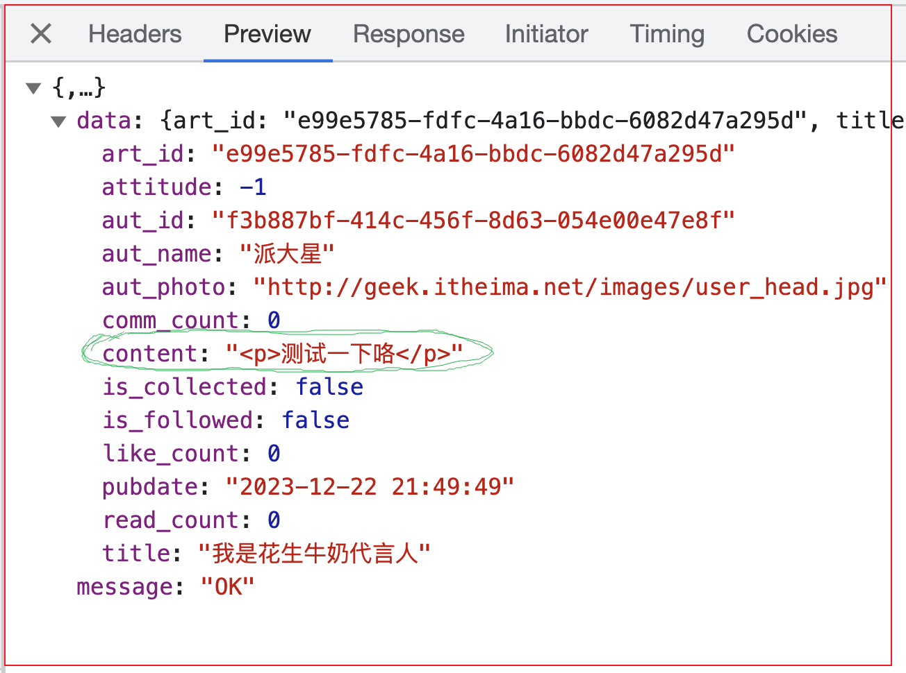
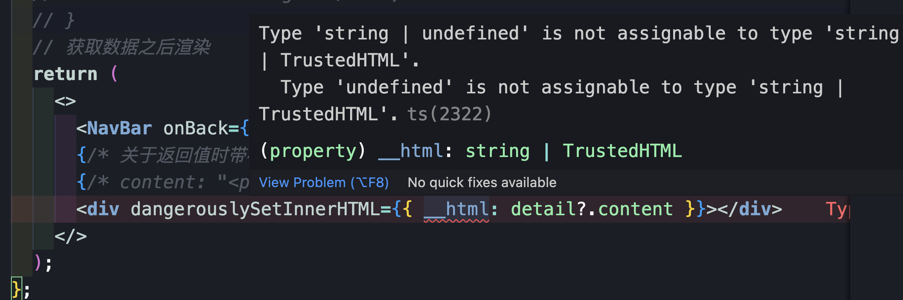

## React + TypeScript + Vite

### 1. 项目环境创建

1. 安装vite工具，并创建项目

    ```bash
    yarn create vite
    ```

2. 设置项目名称

    ```bash
    ? Project name: › react-jike-mobile  // 项目名称
    ```

3. 选择react框架

    ```bash
    ? Select a framework: › - Use arrow-keys. Return to submit.
        Vanilla
        Vue
    ❯   React
        Preact
        Lit
        Svelte
        Solid
        Qwik
        Others
    ```

4. 选择开发语言环境ts

    ```
    ? Select a variant: › - Use arrow-keys. Return to submit.
    ❯   TypeScript
        TypeScript + SWC
        JavaScript
        JavaScript + SWC
    ```

5. 进入项目文件夹，并运行安装包依赖

    ```
    cd react-jike-mobile
    ```

    ```
    yarn 
    ```

6. 运行项目，测试是否安装成功

    ```
    yarn dev
    ```

7. 整理文件结构，生成空白页面

    - 删除src下的部分文件，只保留App.tsx, main.tsx, cite-env.d.ts

    - 清理App.tsx的内容

        ```
        function App() {
          return <>this is an app</>;
        }
        export default App;
        ```

    - 清理main.tsx的内容（删除严格模式）

        ```tsx
        import ReactDOM from "react-dom/client";
        import App from "./App.tsx";
        
        ReactDOM.createRoot(document.getElementById("root")!).render(<App />);
        ```


### 2. 安装antDesignMobile组件库

1. [ant Design Mobile](https://mobile.ant.design/zh)是ant Design家族里专门针对移动端的组件库

2. 查看文档，安装并使用

    - 安装

        ```
        yarn add antd-mobile
        ```

    - 直接引入组件即可，antd-mobile 会自动为你加载 css 样式文件

        ```
        import { Button } from 'antd-mobile'
        ```

    - 在 App中测试一下

        ```tsx
        import { Button } from "antd-mobile";
        function App() {
          return (
            <>
              <p>this is an app</p>
              <Button>this is a button</Button>
            </>
          );
        }
        export default App;
        ```

3. 在文档中搜索Button 按钮，探索更多属性的使用

    ```tsx
    import { Button } from "antd-mobile";
    function App() {
      return (
        <>
          <p>this is an app</p>
          <Button color="success" fill="outline">  {/* 鼠标放置到Button时，ts会自动提示属性和属性值 */}
            this is a button
          </Button>
        </>
      );
    }
    export default App;
    ```


### 3. 配置路径别名

1. 使用场景：项目中各个模块之间的相互导入导出，可以通过@别名路径来做路径的简化。经过配置@相当于src目录。

2. 比如：

    - 配置之前的路径

        ```tsx
        import Detail from ' .. /pages/Detail '
        ```

    - 配置之后的路径

        ```tsx
        import Detail from '@/pages/Detail '
        ```

3. 步骤：

    - 让Vite做路径解析（真实的路劲转换）

        - vite.config.ts中添加配置对象

            ```ts
            import { defineConfig } from "vite";
            import react from "@vitejs/plugin-react";
             // 引入path对象
            import path from "path";
            
            // https://vitejs.dev/config/
            export default defineConfig({
              plugins: [react()],
            
              // 配置路径别名
              resolve: {
                alias: {
                  "@": path.resolve(__dirname, "src"),
                },
              },
            });
            ```

        - 如果你是刚创建的TypeScript项目，有可能会遇到`找不到模块“path”或其相应的类型声明`的错误提示，安装`@types/node`即可

            ```bash
            yarn add @types/node -D
            ```

    - 让VSCode做智能路径提示（开发者体验）

        -  tsconfig.json中添加配置项

            ```json
            {
              "compilerOptions": {
               ...
                "skipLibCheck": true,
            
                // 别名路径的配置项
                "baseUrl": ".",
                "paths": {
                  "@/*": ["src/*"]
                },
            
                /* Bundler mode */
                "moduleResolution": "bundler",
                "allowImportingTsExtensions": true,
               ...
              }
            ```

4. 测试配置是否成功

    -  修改main.ts的路径

        ```tsx
        import ReactDOM from "react-dom/client";
        import App from "@/App"; // 使用路径别名
        
        ReactDOM.createRoot(document.getElementById("root")!).render(<App />);
        ```
        
- 键入@之后会有自定提示的引用文件


### 4. 配置基础路由

1. 安装路由包

    ```bash
    yarn add react-router-dom  
    ```

2. 创建基础page组件，用来匹配路由

    - src文件下创建pages文件夹，并创建Home和Detail页面组件

    - Home组件文件夹下创建index组件界面

        ```tsx
        const Home = () => {
          return (
            <>
              <p>this is Home</p>
            </>
          );
        };
        export default Home;
        ```

    - Detail组件文件夹下创建index组件界面

        ```tsx
        const Detail = () => {
          return (
            <>
              <p>this is Detail</p>
            </>
          );
        };
        export default Detail;
        ```

3. 创建路由表文件

    -  src文件下创建router文件夹，并创建index.tsx路由文件( 注意：这里是tsx格式，ts或js的话，类型报错)

    - index.ts文件中配置路由： 使用**createBrowserRouter**方法创建router实例并导出，createBrowserRouter方法插入配置数组对象（一个一个路由对象）

        ```ts
        import { createBrowserRouter } from "react-router-dom";
        import Home from "@/pages/Home";
        import Detail from "@/pages/Detail/index";
        
        const router = createBrowserRouter([
          {
            path: "/",
            element: "<Home/>",
          },
          {
            path: "/detail",
            element: "<Detail/>",
          },
        ]);
        
        export { router };
        ```

4. Main.ts文件中导入路由表

    - 引入RouterProvider，并传入router对象

        ```tsx
        import ReactDOM from "react-dom/client";
        // import App from "@/App";
        
        
        import { RouterProvider } from "react-router-dom";
        import { router } from "@/router";
        
        ReactDOM.createRoot(document.getElementById("root")!).render(
          <RouterProvider router={router} /> // 这里替换掉App组件
        );
        ```
    
5. 测试配置是否成功
    - http://localhost:5173/
    - http://localhost:5173/detail


### 5. axios基础封装

1. 使用场景：axios作为最流行的请求插件，同样是类型友好的，基于axios做一下基础封装

2. 步骤

    1.  安装axios到项目

        ```bash
        yarn add axios  
        ```

    2. 在utils中封装http模块，主要包括接口基地址，超时时间，拦截器

        - src下新建utils文件夹，并创建http.ts文件
        - http.ts文件中使用axios.**create**方法创建http请求实例httpInstance，并掺入配置对象（设置基路径和请求响应时间）

        -  设置请求拦截器和响应拦截器

        - 导出http请求实例httpInstance

            ```ts
            import axios from "axios";
            
            // 创建http请求实例httpInstance
            const httpInstance = axios.create({
             baseURL: 'http://geek.itheima.net/v1_0',
              timeout: 5000,
            });
            
            // 添加请求拦截器
            httpInstance.interceptors.request.use(
              (config) => {
                return config;
              },
              (error) => {
                return Promise.reject(error);
              }
            );
            
            // 添加响应拦截器
            httpInstance.interceptors.response.use(
              (response) => {
                // 2xx 范围内的状态码都会触发该函数。
                // 对响应数据做点什么
                return response;
              },
              (error) => {
                // 超出 2xx 范围的状态码都会触发该函数。
                // 对响应错误做点什么
                return Promise.reject(error);
              }
            );
            
            // 导出http请求实例
            export { httpInstance };
            ```

    3. 在utils中做统一导出

        -  utils下创建index.ts文件，用于统一导出http请求的中转

            ```ts
            import { httpInstance } from "@/utils/http";
            
            export { httpInstance as http };
            ```

3. 使用： 在所需的api中导入http并使用


### 6. 封装api模块 - axios和ts的配合使用

1. 场景：

    -   axios提供了request泛型方法，方便我们传入类型参数推导出接口返回值的类型

        ```ts
        axios.request<Type>(requestConfig).then(res=>{
        	console.log(res.data)
        })
        ```

    - 说明：我们需要根据返回值的类型，自定义泛型参数Type，并传入给request方法。这样泛型参数Type的类型就决定了res.data的类型

2. 步骤：

    1. 根据接口文档创建一个通用的泛型接口类型（多个接口返回值的结构是相似的）

    2. 根据接口文档创建特有的接口数据类型（每个接口有自己特殊的数据格式）

    3. 组合1和2的类型，得到最终的request泛型的参数类型

        

3.  实现

    1. src文件夹先创建apis模块，新建list.ts文档

    2. list.ts文档中定义数据类型，并创建请求列表的api接口方法，并导出

        ```ts
        import { http } from "@/utils";
        
        //1. 定义通用的泛型参数:传递不同的T，定义不同的data类型
        type ResType<T> = {
          data: T;
          message: string;
        };
        
        //定义具体的接口数据类型（channel的类型）
        type ChannelItem = {
          id: number;
          name: string;
        };
        
        //2. channels的类型
        type ChannelRes = {
          channels: ChannelItem[];
        };
        
        // 定义请求频道列表的api,并传入数据类型(组合上面的 1 和 2 类型)
        export const fetchChannelAPI = () => {
          return http.request<ResType<ChannelRes>>({
            url: "/channels",
          });
        };
        
        ```

4. 测试接口

    - main.ts文件中导入fetchChannelAPI接口，并使用

        ```tsx
        import ReactDOM from "react-dom/client";
        
        import { RouterProvider } from "react-router-dom";
        import { router } from "@/router";
        import { fetchChannelAPI } from "@/apis/list";
        
        // api接口测试
        fetchChannelAPI().then((res) => {
          console.log(res.data.data.channels);
        });
        
        ReactDOM.createRoot(document.getElementById("root")!).render(
          <RouterProvider router={router} />
        );
        ```
        

5. 优化： 将通用的泛型参数定义，提取出来，能让其他api接口导入使用

    - api下新建文件sharedType.ts

    - sharedType.ts文件中创建通用的泛型参数，并导出

        ```ts
        export type ResType<T> = {
          data: T;
          message: string;
        };
        ```

    - list.ts文档中直接导入，并使用

        ```tsx
        import { http } from "@/utils";
        
        // 导入通用的泛型参数
        import { ResType } from "@/apis/sharedType";
        
        //定义具体的接口数据类型（channel的类型）
        type ChannelItem = {
          id: number;
          name: string;
        };
        
        //2. channels的类型
        type ChannelRes = {
          channels: ChannelItem[];
        };
        
        // 定义请求频道列表的api,并传入数据类型
        export const fetchChannelAPI = () => {
          return http.request<ResType<ChannelRes>>({
            url: "/channels",
          });
        };
        ```

        

6. vite工具通用的泛型参数的设置

    - 使用vite工具时，也可以将通用的泛型参数写入vite-env.d.ts中，这样，不需要导出，使用时也不需要导入

    - src文件夹下的vite-env.d.ts文件中定义通用的泛型参数

        ```ts
        /// <reference types="vite/client" />
        
        // api接口响应参数的泛型（公共部分）
        type ResType<T> = {
          data: T;
          message: string;
        };
        ```

    - list.ts文档中无需导入直接使用即可

        ```ts
        import { http } from "@/utils";
        
        //定义具体的接口数据类型（channel的类型）
        type ChannelItem = {
          id: number;
          name: string;
        };
        
        //2. channels的类型
        type ChannelRes = {
          channels: ChannelItem[];
        };
        
        // 定义请求频道列表的api,并传入数据类型
        export const fetchChannelAPI = () => {
          return http.request<ResType<ChannelRes>>({ // 不需要导入通用的泛型参数ResType，直接使用
            url: "/channels",
          });
        };
        ```

    

### 7. Home模块—Channels基础数据渲染

1. 模块组件设计：

    - 整体组件嵌套设计

        

    - 说明：点击不同的标签，切换不同的内容

2. 基础布局的搭建

    - Home文件夹下样式文件index.css

        ```css
        .tabContainer{
          position: fixed;
          height: 50px;
          top: 0;
          width: 100%;
        }
        .listContainer{
          position: fixed;
          top: 50px;
          bottom: 0;
          width: 100%;
            /* 页面滚动 */
          overflow: auto;
        }
        ```

    - 组件中引入index.css样式，并创建tab布局容器

        ```tsx
        import "@/pages/Home/index.css";
        const Home = () => {
          return (
            <>
              <div className="tabContainer">
                {/* tab标签布局区域 */}
                this is Home
              </div>
            </>
          );
        };
        export default Home;
        ```

3. tab布局区域实现步骤

    - 使用ant-mobile组件库中的Tabs组件进行页面结构的创建

        ```tsx
        import "@/pages/Home/index.css";
        import { Tabs } from "antd-mobile";
        const Home = () => {
          return (
            <>
              <div className="tabContainer">
                {/* tab标签布局区域 */}
                <Tabs>
                  <Tabs.Tab title="水果" key="fruits">
                    {/* list组件 */}
                    菠萝
                  </Tabs.Tab>
                  <Tabs.Tab title="蔬菜" key="vegetables">
                    {/* list组件 */}
                    西红柿
                  </Tabs.Tab>
                  <Tabs.Tab title="动物" key="animals">
                    {/* list组件 */}
                    蚂蚁
                  </Tabs.Tab>
                </Tabs>
              </div>
            </>
          );
        };
        export default Home;
        ```

    - 使用真实接口数据进行渲染(调用已经封装的接口)

        ```tsx
        import { ChannelItem, fetchChannelAPI } from "@/apis/list";
        import "@/pages/Home/index.css";
        import { Tabs } from "antd-mobile";
        import { useEffect, useState } from "react";
        
        const Home = () => {
            
          // 1. 创建状态变量，并使用泛型ChannelItem[]来限定useState返回值的类型
          const [channels, setChannels] = useState<ChannelItem[]>([]);
        
          // 2.  调用api接口获取真实数据
          useEffect(() => {
            const getChannels = async () => {
              try {
                const res = await fetchChannelAPI();
                // 3.  保存数据到状态变量中
                setChannels(res.data.data.channels);
              } catch (error) {
                throw new Error("fetch channel API error: " + error);
              }
            };
            getChannels();
          }, []);
          return (
            <>
              <div className="tabContainer">
                {/* tab标签布局区域 */}
                <Tabs defaultActiveKey="1">
        
                  {/* 4. 动态渲染数据到组件中 */}
                  {channels.map((item) => (
                    <Tabs.Tab title={item.name} key={item.id}>
                      {/* list组件 */}
                    </Tabs.Tab>
                  ))}
                  
                </Tabs>
              </div>
            </>
          );
        };
        export default Home;
        ```

4. tab布局的优化 - 数据和布局相分离

    - 场景：当前状态数据的各种操作逻辑和组件的渲染是写在一起的，可以采用自定义hook封装，让逻辑和渲染相分离

        

    - 步骤：

        1. 把和Tabs相关的响应式数据状态以及操作数据的方法放到自定义hook函数中
        
            - src先创建hooks文件夹，并创建**useTabs** 自定义hook函数，并导出
        
                ```ts
                import { ChannelItem, fetchChannelAPI } from "@/apis/list";
                import { useState, useEffect } from "react";
                
                export const useTabs = () => {
                  // 1. 创建状态变量，并使用泛型ChannelItem[]来限定useState返回值的类型
                  const [channels, setChannels] = useState<ChannelItem[]>([]);
                
                  // 2.  调用api接口获取真实数据
                  useEffect(() => {
                    const getChannels = async () => {
                      try {
                        const res = await fetchChannelAPI();
                        // 3.  保存数据到状态变量中
                        setChannels(res.data.data.channels);
                      } catch (error) {
                        throw new Error("fetch channel API error: " + error);
                      }
                    };
                    getChannels();
                  }, []);
                
                  return { channels };
                };
                ```
        
        2. 组件中调用自定义hook函数，消费其返回的数据和方法
        
            - HOME组件中调用useTabs钩子，并解构出channels 使用
        
                ```tsx
                import { useTabs } from "@/hooks/useTabs";
                import "@/pages/Home/index.css";
                import { Tabs } from "antd-mobile";
                const Home = () => {
                  // 组件中调用自定义hook函数，消费其返回的数据和方法
                  const { channels } = useTabs();
                  return (
                    <>
                      <div className="tabContainer">
                        {/* tab标签布局区域 */}
                        <Tabs defaultActiveKey="1">
                          {/* 动态渲染数据到组件中 */}
                          {channels.map((item) => (
                            <Tabs.Tab title={item.name} key={item.id}>
                              {/* list组件 */}
                            </Tabs.Tab>
                          ))}
                        </Tabs>
                      </div>
                    </>
                  );
                };
                export default Home;
                ```

      

### 8. Home模块—List组件数据渲染

1. 搭建基础结构，并获取基础数据

    - Home组件文件夹先创建HomeList组件，并粘贴ant Design Mobile的List组件布局文件及mock数据

        ```tsx
        import { Image, List } from "antd-mobile";
        
        // mock数据
        import { users } from "./users";
        
        export const HomeList = () => {
          return (
            <List header="用户列表">
              {users.map((user) => (
                <List.Item
                  key={user.name}
                  prefix={
                    <Image
                      src={user.avatar}
                      style={{ borderRadius: 20 }}
                      fit="cover"
                      width={40}
                      height={40}
                    />
                  }
                  description={user.description}
                >
                  {user.name}
                </List.Item>
              ))}
            </List>
          );
        };
        ```

        ```ts
        // users.ts文件mock数据
        
        export const users = [
          {
            id: "1",
            avatar:
              "https://images.unsplash.com/photo-1548532928-b34e3be62fc6?ixlib=rb-1.2.1&q=80&fm=jpg&crop=faces&fit=crop&h=200&w=200&ixid=eyJhcHBfaWQiOjE3Nzg0fQ",
            name: "Novalee Spicer",
            description: "Deserunt dolor ea eaque eos",
          },
          {
            id: "2",
            avatar:
              "https://images.unsplash.com/photo-1493666438817-866a91353ca9?ixlib=rb-0.3.5&q=80&fm=jpg&crop=faces&fit=crop&h=200&w=200&s=b616b2c5b373a80ffc9636ba24f7a4a9",
            name: "Sara Koivisto",
            description: "Animi eius expedita, explicabo",
          },
          {
            id: "3",
            avatar:
              "https://images.unsplash.com/photo-1542624937-8d1e9f53c1b9?ixlib=rb-1.2.1&q=80&fm=jpg&crop=faces&fit=crop&h=200&w=200&ixid=eyJhcHBfaWQiOjE3Nzg0fQ",
            name: "Marco Gregg",
            description: "Ab animi cumque eveniet ex harum nam odio omnis",
          },
          {
            id: "4",
            avatar:
              "https://images.unsplash.com/photo-1546967191-fdfb13ed6b1e?ixlib=rb-1.2.1&q=80&fm=jpg&crop=faces&fit=crop&h=200&w=200&ixid=eyJhcHBfaWQiOjE3Nzg0fQ",
            name: "Edith Koenig",
            description: "Commodi earum exercitationem id numquam vitae",
          },
        ];
        
        ```

    - Home组件中使用HomeList组件

        ```tsx
        import { useTabs } from "@/hooks/useTabs";
        import "@/pages/Home/index.css";
        import { Tabs } from "antd-mobile";
        import { HomeList } from "./HomeList";
        const Home = () => {
          // 组件中调用自定义hook函数，消费其返回的数据和方法
          const { channels } = useTabs();
          return (
            <>
              <div className="tabContainer">
                {/* tab标签布局区域 */}
                <Tabs defaultActiveKey="1">
                  {/* 动态渲染数据到组件中 */}
                  {channels.map((item) => (
                    <Tabs.Tab title={item.name} key={item.id}>
                      {/* list组件 */}
                      <HomeList />
                    </Tabs.Tab>
                  ))}
                </Tabs>
              </div>
            </>
          );
        };
        export default Home;
        ```

    - 定义请求文章列表的api ： 根据接口文档定义请求参数和响应数据的类型

        ```ts
        import { http } from "@/utils";
        
        /* --------------------- channel数据部分 -------------------- */
        //定义具体的接口数据类型（channel的类型）
        export type ChannelItem = {
          id: number;
          name: string;
        };
        
        //2. channels的类型
        type ChannelRes = {
          channels: ChannelItem[];
        };
        
        // 定义请求频道列表的api,并传入数据类型(组合上面的 1 和 2 类型)
        export const fetchChannelAPI = () => {
          return http.request<ResType<ChannelRes>>({
            url: "/channels",
          });
        };
        
        /* ----------------------- 文章列表数据部分 ----------------------- */
        // 定义文章数据对象类型
        type ListItem = {
          art_id: string;
          title: string;
          aut_id: string;
          comm_count: number;
          pubdate: string;
          aut_name: string;
          is_top: 0 | 1;
          cover: {
            type: string;
            images: string[];
          };
        };
        
        type ListRes = {
          results: ListItem[];
          pre_timestamp: string;
        };
        
        // 请求参数类型
        type ParmasType = {
          channel_id: string;
          timestamp: string;
        };
        
        // 定义获取文章列表的API
        export const fetchListAPI = (params: ParmasType) => {
          return http.request<ResType<ListRes>>({
            url: "articles",
            params,
          });
        };
        ```

    - 调用API接口，获取真实数据，并渲染文章列表到页面

        ```tsx
        import { Image, List } from "antd-mobile";
        
        // // mock数据
        // import { users } from "./users";
        import { useEffect, useState } from "react";
        import { ListRes, fetchListAPI } from "@/apis/list";
        
        export const HomeList = () => {
          /* ------------------- 调用API接口，获取真实数据 ------------------- */
          const [articleList, setArticleList] = useState<ListRes>({
            results: [],
            pre_timestamp: "" + new Date().getTime(),
          });
          useEffect(() => {
            const getArticleList = async () => {
              try {
                const res = await fetchListAPI({
                  channel_id: "0",
                  timestamp: "" + new Date().getTime,
                });
                setArticleList({
                  results: res.data.data.results,
                  pre_timestamp: res.data.data.pre_timestamp,
                });
              } catch (error) {
                throw new Error("fetchListAPI error");
              }
            };
            getArticleList();
          }, []);
          return (
            <List header="文章列表">
              {articleList.results.map((item) => (
                <List.Item
                  key={item.art_id}
                  prefix={
                    <Image
                      src={item.cover.images?.[0]}
                      style={{ borderRadius: 20 }}
                      fit="cover"
                      width={40}
                      height={40}
                    />
                  }
                  description={item.pubdate}
                >
                  {item.title}
                </List.Item>
              ))}
            </List>
          );
        };
        ```

2. 为组件设计channelID参数，点击tab时传入不同的参数

    - 给HomeList组件添加参数，用来绑定不同的tab

        ```tsx
        import { Image, List } from "antd-mobile";
        import { useEffect, useState } from "react";
        import { ListRes, fetchListAPI } from "@/apis/list";
        
        // 定义params参数类型
        type ParmasType = {
          channelID: string;
        };
        export const HomeList = (params: ParmasType) => {
          // 解构出params参数
          const { channelID } = params;
        
          /* ------------------- 调用API接口，获取真实数据 ------------------- */
          const [articleList, setArticleList] = useState<ListRes>({
            results: [],
            pre_timestamp: "" + new Date().getTime(),
          });
          useEffect(() => {
            const getArticleList = async () => {
              try {
                const res = await fetchListAPI({
                  channel_id: channelID, // 使用params参数
                  timestamp: "" + new Date().getTime,
                });
                setArticleList({
                  results: res.data.data.results,
                  pre_timestamp: res.data.data.pre_timestamp,
                });
              } catch (error) {
                throw new Error("fetchListAPI error");
              }
            };
            getArticleList();
          }, [channelID]);
          return (
            <List header="文章列表">
              {articleList.results.map((item) => (
                <List.Item
                  key={item.art_id}
                  prefix={
                    <Image
                      src={item.cover.images?.[0]}
                      style={{ borderRadius: 20 }}
                      fit="cover"
                      width={40}
                      height={40}
                    />
                  }
                  description={item.pubdate}
                >
                  {item.title}
                </List.Item>
              ))}
            </List>
          );
        };
        ```

    - Home组件把channelID值传递过去

        ```tsx
        import { useTabs } from "@/hooks/useTabs";
        import "@/pages/Home/index.css";
        import { Tabs } from "antd-mobile";
        import { HomeList } from "./HomeList";
        const Home = () => {
          // 组件中调用自定义hook函数，消费其返回的数据和方法
          const { channels } = useTabs();
          return (
            <>
              <div className="tabContainer">
                {/* tab标签布局区域 */}
                <Tabs defaultActiveKey="1">
                  {/* 动态渲染数据到组件中 */}
                  {channels.map((item) => (
                    <Tabs.Tab title={item.name} key={item.id}>
                      {/* list组件 */}
        
                      <HomeList
                        //把channelID传递过去，数值item.id转换为字符串
                        channelID={"" + item.id}
                      />
                      
                    </Tabs.Tab>
                  ))}
                </Tabs>
              </div>
            </>
          );
        };
        export default Home;
        ```

        

### 9. Home模块—List组件无限滚动渲染

1. 场景：list列表在滑动到底部时，自动加载下一页雷彪数据

2. 思路：

    1. 滑动到底部触发加载下一页动作 : <InfiniteScroll/>

        - 查看antDesignMobile文档的<InfiniteScroll/>组件的使用方法

            
            
        - Home组件中, 给渲染HomeLis的区域添加布局限定 class=' listContainer '

            ```tsx
            import { useTabs } from "@/hooks/useTabs";
            import "@/pages/Home/index.css";
            import { Tabs } from "antd-mobile";
            import { HomeList } from "./HomeList";
            const Home = () => {
              // 组件中调用自定义hook函数，消费其返回的数据和方法
              const { channels } = useTabs();
              return (
                <>
                  <div className="tabContainer">
                    {/* tab标签布局区域 */}
                    <Tabs defaultActiveKey="0">
                      {/* 动态渲染数据到组件中 */}
                      {channels.map((item) => (
                        <Tabs.Tab title={item.name} key={item.id}>
                          {/* list组件 */}
            
                          {/* 添加HomeList的布局 */}
                          <div className="listContainer">
                            <HomeList
                              //把channelID传递过去，数值item.id转换为字符串
                              channelID={"" + item.id}
                            />
                          </div>
                          
                        </Tabs.Tab>
                      ))}
                    </Tabs>
                  </div>
                </>
              );
            };
            export default Home;
            ```
            
        - HomeList组件中引入InfiniteScroll组件，并设置滚动的属性和逻辑

            ```tsx
            import { Image, InfiniteScroll, List } from "antd-mobile";
            import { useEffect, useState } from "react";
            import { ListRes, fetchListAPI } from "@/apis/list";
            
            // 定义params参数类型
            type ParmasType = {
              channelID: string;
            };
            export const HomeList = (params: ParmasType) => {
              // 解构出params参数
              const { channelID } = params;
            
              /* ------------------- 调用API接口，获取真实数据 ------------------- */
              const [articleList, setArticleList] = useState<ListRes>({
                results: [],
                pre_timestamp: "" + new Date().getTime(),
              });
              useEffect(() => {
                const getArticleList = async () => {
                  try {
                    const res = await fetchListAPI({
                      channel_id: channelID, // 使用params参数
                      timestamp: "" + new Date().getTime,
                    });
                    setArticleList({
                      results: res.data.data.results,
                      pre_timestamp: res.data.data.pre_timestamp,
                    });
                  } catch (error) {
                    throw new Error("fetchListAPI error");
                  }
                };
                getArticleList();
              }, [channelID]);
            
              /* --------------------- 无限滚动页面加载的逻辑 -------------------- */
              const [hasMore, setHasMore] = useState(true);
            
              // 注意：loadMore是异步函数，需要加async字段
              const loadMore = async () => {
                // 无限滚动的逻辑
              };
              return (
                <>
                  <List header="文章列表">
                    {articleList.results.map((item) => (
                      <List.Item
                        key={item.art_id}
                        prefix={
                          <Image
                            src={item.cover.images?.[0]}
                            style={{ borderRadius: 20 }}
                            fit="cover"
                            width={40}
                            height={40}
                          />
                        }
                        description={item.pubdate}
                      >
                        {item.title}
                      </List.Item>
                    ))}
                  </List>
                  {/* 添加无限滚动页面的组件 */}
                  <InfiniteScroll
                    // 触发无限滚动的回调函数
                    loadMore={loadMore}
                    // 是否继续无限滚动的开关
                    hasMore={hasMore}
                    // 距离页面底部多少时触发？可选，默认是250px
                    threshold={100}
                  />
                </>
              );
            };
            ```

    2. 加载下一页数据 ：per_timestamp接口数据

        - 查看文档，需要上次请求的时间戳来进行下次请求

            

    3. 把老数据和新数据拼接处理 ： [ ...oldList, ...newList ]

    4. 停止监听边界值 ： hasMore

        ```tsx
        import { Image, InfiniteScroll, List } from "antd-mobile";
        import { useEffect, useState } from "react";
        import { ListRes, fetchListAPI } from "@/apis/list";
        
        // 定义params参数类型
        type ParmasType = {
          channelID: string;
        };
        export const HomeList = (params: ParmasType) => {
          // 解构出params参数
          const { channelID } = params;
        
          /* ------------------- 调用API接口，获取真实数据 ------------------- */
          const [articleList, setArticleList] = useState<ListRes>({
            results: [],
            pre_timestamp: "" + new Date().getTime(),
          });
          useEffect(() => {
            const getArticleList = async () => {
              try {
                const res = await fetchListAPI({
                  channel_id: channelID, // 使用params参数
                  timestamp: "" + new Date().getTime,
                });
                setArticleList({
                  results: res.data.data.results,
                  pre_timestamp: res.data.data.pre_timestamp,
                });
              } catch (error) {
                throw new Error("fetchListAPI error");
              }
            };
            getArticleList();
          }, [channelID]);
        
          /* --------------------- 无限滚动页面加载的逻辑 -------------------- */
          const [hasMore, setHasMore] = useState(true);
        
          // 注意：loadMore是异步函数，需要加async字段
          const loadMore = async () => {
            /* ----------------------- 页面无限滚动的逻辑 ---------------------- */
            // 2. 发起下一次请求，加载下一页数据
            try {
              const res = await fetchListAPI({
                channel_id: channelID,
                // 需要上次请求的时间戳来进行下次请求
                timestamp: articleList.pre_timestamp,
              });
              setArticleList({
                // 3. 把老数据和新数据拼接处理 ： [ ...oldList, ...newList ]
                results: [...articleList.results, ...res.data.data.results],
                pre_timestamp: res.data.data.pre_timestamp,
              });
              // 4. 更新停止监听边界值 ： hasMore
              if (res.data.data.results.length === 0) {
                setHasMore(false);
              }
            } catch (error) {
              throw new Error("fetchListAPI error");
            }
          };
          return (
            <>
              <List header="文章列表">
                {articleList.results.map((item) => (
                  <List.Item
                    key={item.art_id}
                    prefix={
                      <Image
                        src={item.cover.images?.[0]}
                        style={{ borderRadius: 20 }}
                        fit="cover"
                        width={40}
                        height={40}
                      />
                    }
                    description={item.pubdate}
                  >
                    {item.title}
                  </List.Item>
                ))}
              </List>
              {/* 添加无限滚动页面的组件 */}
              <InfiniteScroll
                // 触发无限滚动的回调函数
                loadMore={loadMore}
                // 是否继续无限滚动的开关
                hasMore={hasMore}
                // 距离页面底部多少时触发？可选，默认是250px
                threshold={10}
              />
            </>
          );
        };
        ```

3. 优化—自定义hook，将逻辑和渲染相分离

    - hooks文件夹下创建useLists钩子，并抽封逻辑代码

        ```ts
        import { ListRes, fetchListAPI } from "@/apis/list";
        import { useEffect, useState } from "react";
        
        export const useLists = (channelID: string) => {
          /* ------------------- 调用API接口，获取真实数据 ------------------- */
          const [articleList, setArticleList] = useState<ListRes>({
            results: [],
            pre_timestamp: "" + new Date().getTime(),
          });
        
          useEffect(() => {
            const getArticleList = async () => {
              try {
                const res = await fetchListAPI({
                  channel_id: channelID, // 使用params参数
                  timestamp: "" + new Date().getTime,
                });
                setArticleList({
                  results: res.data.data.results,
                  pre_timestamp: res.data.data.pre_timestamp,
                });
              } catch (error) {
                throw new Error("fetchListAPI error");
              }
            };
            getArticleList();
          }, [channelID]);
        
          /* --------------------- 无限滚动页面加载的逻辑 -------------------- */
          const [hasMore, setHasMore] = useState(true);
        
          // 注意：loadMore是异步函数，需要加async字段
          const loadMore = async () => {
            /* ----------------------- 页面无限滚动的逻辑 ---------------------- */
            // 2. 发起下一次请求，加载下一页数据
            try {
              const res = await fetchListAPI({
                channel_id: channelID,
                // 需要上次请求的时间戳来进行下次请求
                timestamp: articleList.pre_timestamp,
              });
              setArticleList({
                // 3. 把老数据和新数据拼接处理 ： [ ...oldList, ...newList ]
                results: [...articleList.results, ...res.data.data.results],
                pre_timestamp: res.data.data.pre_timestamp,
              });
              // 4. 更新停止监听边界值 ： hasMore
              if (res.data.data.results.length === 0) {
                setHasMore(false);
              }
            } catch (error) {
              throw new Error("fetchListAPI error");
            }
          };
        
          return { articleList, hasMore, loadMore };
        };
        
        ```

    - HomeList组件中调用自定义钩子useLists，使用数据

        ```tsx
        import { Image, InfiniteScroll, List } from "antd-mobile";
        import { useLists } from "@/hooks/useLists";
        
        // 定义params参数类型
        type ParmasType = {
          channelID: string;
        };
        export const HomeList = (params: ParmasType) => {
          // 解构出params参数
          const { channelID } = params;
        
          // 调用自定义hook，并解构出所需的数据和方法
          const { articleList, hasMore, loadMore } = useLists(channelID);
          return (
            <>
              <List header="文章列表">
                {articleList.results.map((item) => (
                  <List.Item
                    key={item.art_id}
                    prefix={
                      <Image
                        src={item.cover.images?.[0]}
                        style={{ borderRadius: 20 }}
                        fit="cover"
                        width={40}
                        height={40}
                      />
                    }
                    description={item.pubdate}
                  >
                    {item.title}
                  </List.Item>
                ))}
              </List>
              {/* 添加无限滚动页面的组件 */}
              <InfiniteScroll
                // 触发无限滚动的回调函数
                loadMore={loadMore}
                // 是否继续无限滚动的开关
                hasMore={hasMore}
                // 距离页面底部多少时触发？可选，默认是250px
                threshold={10}
              />
            </>
          );
        };
        ```

        

### 10. Detail模块—路由跳转和数据渲染

1. 需求：点击文章列表某一项，跳转对应的文章详情页

    

2. 步骤：

    1. 通过路由跳转方法进行跳转，并传递参数（id)

        - 自定义钩子中编写路由跳转逻辑

        ```ts
        import { ListRes, fetchListAPI } from "@/apis/list";
        import { useEffect, useState } from "react";
        import { useNavigate } from "react-router-dom";
        
        export const useLists = (channelID: string) => {
          /* ------------------- 调用API接口，获取真实数据 ------------------- */
          const [articleList, setArticleList] = useState<ListRes>({
            results: [],
            pre_timestamp: "" + new Date().getTime(),
          });
        
          useEffect(() => {
            const getArticleList = async () => {
              try {
                const res = await fetchListAPI({
                  channel_id: channelID, // 使用params参数
                  timestamp: "" + new Date().getTime,
                });
                setArticleList({
                  results: res.data.data.results,
                  pre_timestamp: res.data.data.pre_timestamp,
                });
              } catch (error) {
                throw new Error("fetchListAPI error");
              }
            };
            getArticleList();
          }, [channelID]);
        
          /* --------------------- 无限滚动页面加载的逻辑 -------------------- */
          const [hasMore, setHasMore] = useState(true);
        
          // 注意：loadMore是异步函数，需要加async字段
          const loadMore = async () => {
            /* ----------------------- 页面无限滚动的逻辑 ---------------------- */
            // 2. 发起下一次请求，加载下一页数据
            try {
              const res = await fetchListAPI({
                channel_id: channelID,
                // 需要上次请求的时间戳来进行下次请求
                timestamp: articleList.pre_timestamp,
              });
              setArticleList({
                // 3. 把老数据和新数据拼接处理 ： [ ...oldList, ...newList ]
                results: [...articleList.results, ...res.data.data.results],
                pre_timestamp: res.data.data.pre_timestamp,
              });
              // 4. 更新停止监听边界值 ： hasMore
              if (res.data.data.results.length === 0) {
                setHasMore(false);
              }
            } catch (error) {
              throw new Error("fetchListAPI error");
            }
          };
        
          /* ----------------------- 跳转路由逻辑 ----------------------- */
          const navigate = useNavigate();
          // 跳转详情路由的回调, 并携带参数id
          const goToDetail = (id: string) => {
            navigate(`/detail?id=${id}`);
          };
        
          return { articleList, hasMore, loadMore, goToDetail };
        };
        
        ```

        - 给list注册点击事件，实现点击跳转，并携带参数id过去

        ```tsx
        import { Image, InfiniteScroll, List } from "antd-mobile";
        import { useLists } from "@/hooks/useLists";
        
        // 定义params参数类型
        type ParmasType = {
          channelID: string;
        };
        export const HomeList = (params: ParmasType) => {
          // 解构出params参数
          const { channelID } = params;
        
          // 调用自定义hook，并解构出所需的数据和方法
          const { articleList, hasMore, loadMore, goToDetail } = useLists(channelID);
          return (
            <>
              <List header="文章列表">
                {articleList.results.map((item) => (
                  <List.Item
                    key={item.art_id}
                    prefix={
                      <Image
                        src={item.cover.images?.[0]}
                        style={{ borderRadius: 20 }}
                        fit="cover"
                        width={40}
                        height={40}
                      />
                    }
                    description={item.pubdate}
                    
                    // 点击跳转路由，并携带参数id
                    onClick={() => goToDetail(item.art_id)}
                  >
                    {item.title}
                  </List.Item>
                ))}
              </List>
              {/* 添加无限滚动页面的组件 */}
              <InfiniteScroll
                // 触发无限滚动的回调函数
                loadMore={loadMore}
                // 是否继续无限滚动的开关
                hasMore={hasMore}
                // 距离页面底部多少时触发？可选，默认是250px
                threshold={10}
              />
            </>
          );
        };
        ```

    2. 在详情路由下获取参数，并请求数据

        - 封装获取文章请求的接口：根据接口文档，定义数据类型
        - apis文件夹下新建detail.ts，并编写封装逻辑

        ```ts
        import { http } from "@/utils";
        
        // 定义数据类型
        /**
         * 响应数据
         */
        export type DetailDataRes = {
          /**
           * 文章id
           */
          art_id: string;
          /**
           * 文章-是否被点赞，-1无态度, 0未点赞, 1点赞, 是当前登录用户对此文章的态度
           */
          attitude: number;
          /**
           * 文章作者id
           */
          aut_id: string;
          /**
           * 文章作者名
           */
          aut_name: string;
          /**
           * 文章作者头像，无头像, 默认为null
           */
          aut_photo: string;
          /**
           * 文章_评论总数
           */
          comm_count: number;
          /**
           * 文章内容
           */
          content: string;
          /**
           * 文章-是否被收藏，true(已收藏)false(未收藏)是登录的用户对此文章的收藏状态
           */
          is_collected: boolean;
          /**
           * 文章作者-是否被关注，true(关注)false(未关注), 说的是当前登录用户对这个文章作者的关注状态
           */
          is_followed: boolean;
          /**
           * 文章_点赞总数
           */
          like_count: number;
          /**
           * 文章发布时间
           */
          pubdate: string;
          /**
           * 文章_阅读总数
           */
          read_count: number;
          /**
           * 文章标题
           */
          title: string;
        };
        
        // 封装api接口
        export const fetchDetailApi = (article_id: string) => {
          return http.request<ResType<DetailDataRes>>({
            url: `articles/${article_id}`,
          });
        };
        ```

        - 封装自定义钩子，获取文章详情数据

        ```ts
        import { DetailDataRes, fetchDetailApi } from "@/apis/detail";
        import { useEffect, useState } from "react";
        import { useSearchParams } from "react-router-dom";
        
        export const useDetails = () => {
          const [detail, setDetail] = useState<DetailDataRes | null>(null);
        
          // 获取路由参数
          const [searchParams] = useSearchParams();
          const id = searchParams.get("id");
        
          // 调用接口获取数据
          useEffect(() => {
            const getDetail = async () => {
              const res = await fetchDetailApi(id!); // (id!)添加！解决类型错误
              setDetail(res.data.data);
            };
            getDetail();
          }, [id]);
        
          return { detail };
        };
        ```

    3. 渲染数据到页面

        - 自定义hook中添加返回的逻辑

        ```ts
        import { DetailDataRes, fetchDetailApi } from "@/apis/detail";
        import { useEffect, useState } from "react";
        import { useNavigate, useSearchParams } from "react-router-dom";
        
        export const useDetails = () => {
          const [detail, setDetail] = useState<DetailDataRes | null>(null);
        
          // 获取路由参数
          const [searchParams] = useSearchParams();
          const id = searchParams.get("id");
        
          // 调用接口获取数据
          useEffect(() => {
            const getDetail = async () => {
              const res = await fetchDetailApi(id!); // (id!)添加！解决类型错误
              setDetail(res.data.data);
            };
            getDetail();
          }, [id]);
        
          // 返回按钮的回调
          const navigate = useNavigate();
          const goBack = () => {
            navigate(-1);
          };
        
          return { detail, goBack };
        };
        ```

        - Detail组件中调用自定义hook，解构出状态数据并渲染

        ```tsx
        import { useDetails } from "@/hooks/useDetails";
        import { NavBar } from "antd-mobile";
        
        const Detail = () => {
          const { detail, goBack } = useDetails();
        
          // 设置未获取数据之前加载项，可防止返回值时带标签的字符串的渲染时的类型错误
          if (!detail) {
            return <div>Loading...</div>;
          }
          // 获取数据之后渲染
          return (
            <>
              <NavBar onBack={goBack}>{detail?.aut_name}</NavBar>
              {/* 关于返回值时带标签的字符串的渲染 */}
              {/* content: "<p>22222</p>" */}
              <div dangerouslySetInnerHTML={{ __html: detail?.content }}></div>
            </>
          );
        };
        export default Detail;
        ```

3. 注意事项：

    - 对于返回参数是带标签字符串的渲染

        

    - 不能直接渲染到页面，无法识别标签

         ```tsx
           return (
             <>
               <NavBar onBack={goBack}>{detail?.aut_name}</NavBar>
               {/* 直接渲染无法识别标签 */}
              <div>{detail.content}</div>
             </>
           );
         ```
    
    - 要使用 dangerouslySetInnerHTML**=**{ __html**:** string **|** TrustedHTML} 属性，将返回的数据赋值给__配置对象的“__html”属性
    
         ```tsx
         return (
             <>
               <NavBar onBack={goBack}>{detail?.aut_name}</NavBar>
               {/* 关于返回值时带标签的字符串的渲染 */}
               {/* content: "<p>22222</p>" */}
               <div dangerouslySetInnerHTML={{ __html: detail?.content }}></div>
             </>
           );
         ```
    
    - 但是会有类型不匹配问题，应为返回值有可能是空值
    
        
    
    - 可以在渲染页面之前，添加判断，如果没有返回数据，则渲染loading, 否则，才会渲染返回的内容
    
        ```tsx
        // 设置未获取数据之前加载项，可防止返回值时带标签的字符串的渲染时的类型错误
          if (!detail) {
            return <div>Loading...</div>;
          }
          // 获取数据之后渲染
          return (
            <>
              <NavBar onBack={goBack}>{detail?.aut_name}</NavBar>
              {/* 关于返回值时带标签的字符串的渲染 */}
              {/* content: "<p>22222</p>" */}
              <div dangerouslySetInnerHTML={{ __html: detail?.content }}></div>
            </>
          );
        ```
    
        
